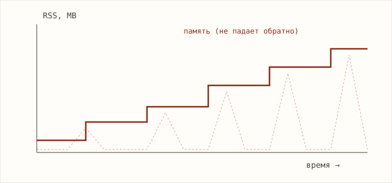
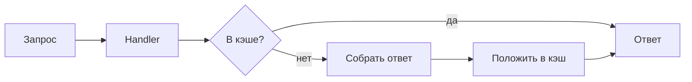

> Это образец статьи. Замени его своим первым постом, а потом удали этот файл.
> Узкая конкретная тема из твоей работы > общий гайд «обо всём».

Сервис на Rust под продовой нагрузкой вёл себя странно: RSS рос на
несколько мегабайт в час и никогда не возвращался обратно. Не падало,
но через пару недель упёрлось бы в лимит контейнера. Вот как я
локализовал причину — и почему она оказалась не там, где я искал
сначала.

## Симптом

Первое, что бросилось в глаза на графике — память росла ступеньками,
синхронно с пиками трафика, но между пиками не освобождалась:



Ступеньки — важная деталь. Это не равномерная течь, а накопление,
привязанное к обработке запросов.

## Где я искал — и ошибся

Первая гипотеза была очевидной: где-то держим ссылки и не отпускаем.
Путь запроса выглядел так:



Я полез в кэш — и зря потратил полдня. Кэш был ограничен по размеру и
вёл себя корректно. Урок: график показывал привязку к трафику, но я
выбрал самое заметное подозреваемое место вместо самого вероятного.

## Что нашлось на самом деле

Профилирование через `heaptrack` показало, что аллокации копятся не в
кэше, а в буфере метрик. Каждый запрос пушил лейбл с уникальным
значением (id пользователя), а библиотека метрик хранила по каждому
уникальному лейблу отдельную серию — и не вытесняла старые:

```rust
// Было: кардинальность лейбла не ограничена.
// Каждый новый user_id = новая навсегда живущая серия.
metrics::counter!("requests_total", "user_id" => user_id.to_string())
    .increment(1);

// Стало: убрал высококардинальный лейбл из метрики.
metrics::counter!("requests_total", "route" => route).increment(1);
```

Это классическая ловушка высокой кардинальности в метриках — она
выглядит как утечка памяти, но это не баг рантайма, а ошибка дизайна
наблюдаемости.

## Что это сказало про систему

Главный вывод даже не про конкретный фикс. Привязка лейблов к
пользовательским id означала, что **слой метрик неявно хранил
пользовательское состояние** — а он для этого не предназначен. Это
сигнал: граница между «бизнес-данными» и «телеметрией» в сервисе была
размыта. После фикса я прошёлся по остальным метрикам и убрал ещё два
таких лейбла.

Мораль для меня: утечка памяти иногда — это симптом архитектурной
протечки ответственности, а не баг сам по себе.
